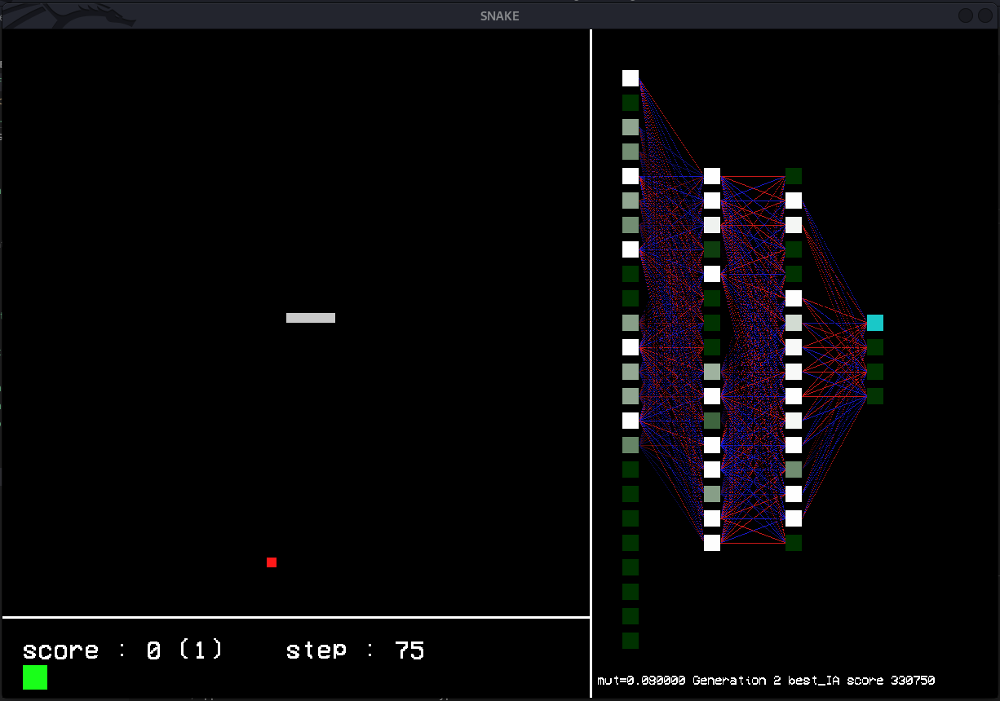

<h1>Snake IA</h1>

Snake automation
The snake are controled by a neural network which has been trained with genetic algorithm

The training still weak

<h3>Compilation</h3>

<code> ~$ sudo apt-get install build-essential</code> 
<code> ~$ sudo apt-get install libsdl-dev libsdl-ttf2.0-dev</code> 

Then you can launch make

<code> ~$ make</code> 

<h3>In training</h3>

There is a display of the values from the neural network

The program is a bit bugged because it trains a lot of neural network in the background and finnaly display the best of the brains
so don't worry if in the start of the program you have to wait